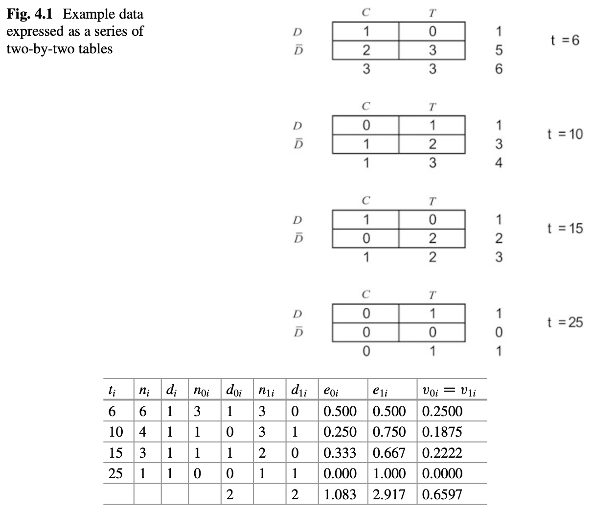

# Nonparametric Comparision of Survival Distributions

## Comparing Two Groups of Survival Times

- two-side test vs one-sided test
- two-sample Students t-test
- rank-based Mann-Whitney test

For survival analysis, nonparametric tests for

- $H_0:S_1(t)=S_0(t)$
- one-side: $H_A:S_1(t)>S_0(t)$
- two-side: $H_A: S_1(t) \neq S_0(t)$

The relationship between $S_1(t)$ and $S_0(t)$ can be different with differnt $t$

Lehman alternation: $H_A: S_1(t)=[S_0(t)]^\psi$, which is equivalent to $h_1(t)=\psi h_0(t)$. Then the one sided test would be $H_0:\psi=1$ vs $H_1: \psi<1$.

Construct a two-by-two table for each failure time $t_i$, with $n_{0i}$ and $n_{1i}$ being the numbers at risk in group 1 and 2, and $d_{0i}$ and $d_{1i}$ being the number of failures in group 1 and 2. Based on hypergeometric distribution, we can have

$$p(d_{0i}|n_{0i},n_{1i},d_i)=\frac{\binom{n_{0i}}{d_{0i}}\binom{n_{1i}}{d_{1i}}}{\binom{n_i}{d_i}}$$
, where $$\binom{n}{d}=\frac{n!}{d!(n-d)!}$$

The expected mean $e_{0i}$ and variance $v_{0i}$ can be given by

$$e_{0i}=E(d_{0i})=\frac{n_{0i}d_i}{n_i}$$

$$v_{0i}=var(d_{0i})=\frac{n_{0i}n_{1i}d_i(n_i-d_i)}{n_i^2(n_i-1)}$$

We can sum the differences between the expected and observed values to get the test statistics $U_0$ and its variance V_0

$$U_0=\sum_{i=1}^D(d_{0i}-e_{0i})=\sum d_{0i} - \sum e_{0i}$$

$$V_0=var(U_0)=\sum v_{0i}$$

Then the test statistic is

$$\frac{U_0}{\sqrt{V_0}} \sim N(0,1)$$
, or

$$\frac{U_0^2}{V_0} \sim \chi^2_1$$

This test is known as the log-rank test.

```{r}
library(survival)
tt = c(6, 7, 10, 15, 19, 25)
delta = c(1, 0, 1, 1, 0, 1)
trt = c(0, 0, 1, 0, 1, 1)  ## group 0 or 1
survdiff(Surv(tt, delta)~trt)
```

A full table is



The log-rank statistic is identical to Cochran-Mantel-Haenzel test in epidemiology, and may also be derived from the proportional hazards model.

A generalization is to define a weighted log-rank test using weights $w_i$ for D time points,

$$U_0(w)=\sum w_i(d_{0i}-e_{0i})$$

$$var(U_0)=\sum w_i^2v_{0i}=V_0(w)$$

The most common way of setting weights is to sue the product-limit estimator from the combined sample

$$w_i=\{\hat{S}(t_i)\}^\rho$$

A log-rank test using these weights is called the Fleming-Harrington $G(\rho)$ test. If $\rho=0$, this test is equivalent to the log-rank test. If $\rho=1$, the test is called Prentice modification/Peto-Peto modification of the Gehan-Wilcoxon test, which place higher weight on the earlier survival differences.

Back to Example 1.3

```{r}
library(asaur)
attach(pancreatic)
Progression.d = as.Date(as.character(progression), "%m/%d/%Y")
OnStudy.d = as.Date(as.character(onstudy), "%m/%d/%Y")
Death.d = as.Date(as.character(death), "%m/%d/%Y")

progressionOnly = Progression.d - OnStudy.d
overallSurvival = Death.d - OnStudy.d
pfs = progressionOnly
pfs[is.na(pfs)] = overallSurvival[is.na(pfs)] ### PFS: progression or death, whichever comes first

pfs.month = pfs/30.5
plot(survfit(Surv(pfs.month) ~ stage), xlab="Time in months", ylab="Survival probability",
    col=c("blue", "red"), lwd=2)
legend("topright", legend=c("Locally advanced", "Metastatic"), col=c("blue","red") , lwd=2)

survdiff(Surv(pfs) ~ stage, rho=0) ### log-rank test

survdiff(Surv(pfs) ~ stage, rho=1) ### Prentice modification
```

## Stratified Tests

If we need to compare two groups while adjusting for another covariate, we can 

- include the other covarite (or multiple covarites) as regression terms for the hazard function (following chapters)
- use stratified log-rank test, if the covariate we are adjusting for is categorical with a small number of levels $G$

The p value is 0.00299 for Prentice modification test, but 0.134 for log-rank test. From Figure, we can see the metastatic group shows an early survival advantage over the locally advanced group, but the survival curves converge after about 10 months.
